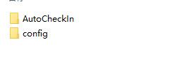
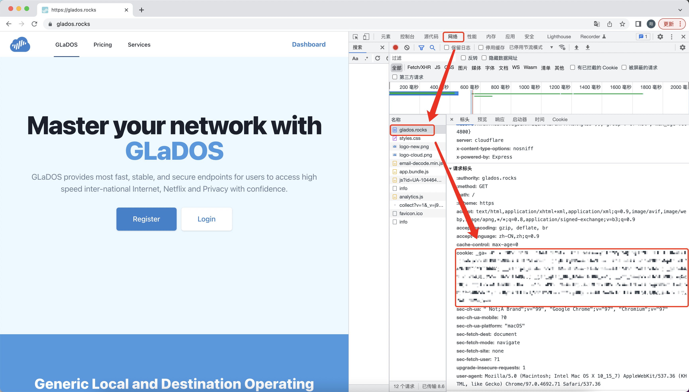
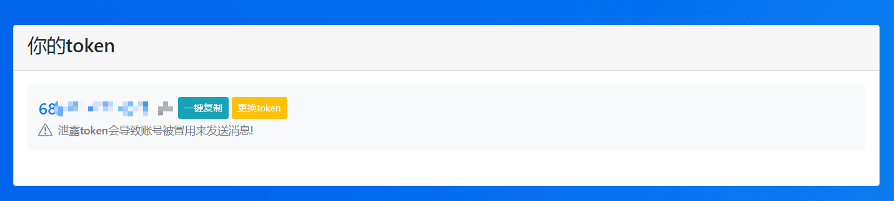
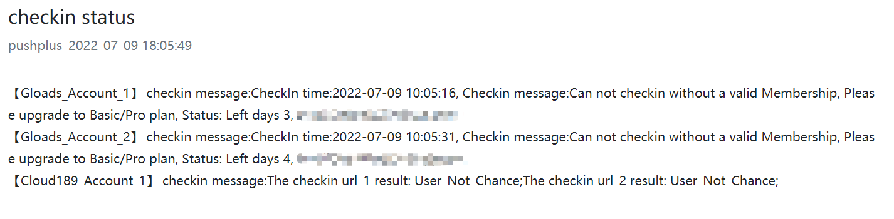

# 本仓库发布的脚本及其中涉及的任何解密分析脚本，仅用于测试和学习研究，禁止用于商业用途，不能保证其合法性，准确性，完整性和有效性，请根据情况自行判断。本项目内所有资源文件，禁止任何公众号、自媒体进行任何形式的转载、发布。您必须在下载后的24小时内从计算机或手机中完全删除以上内容，任何人使用本仓库脚本不得用于非法用途，任何使用者一旦使用本仓库脚本默认同意以上协议，任何人将本仓库脚本用于非法用途所造成的一切后果由非法用途使用者承担

# Auto_CheckIn 多平台自动签到

- 支持多用户签到
- 支持推送消息到pushplus平台(server酱和pushplus选择一个就好，也可以同时推送，如果不配置则不进行推送)
- 支持推送消息到server酱(server酱和pushplus选择一个就好，也可以同时推送，如果不配置则不进行推送)

## 已打包文件地址，可直接下载解压使用，配置Config.json即可，进入AutoCheckin找到exe点击启动，地址：https://www.aliyundrive.com/s/yACmJF4ieJt  提取码: sj27

## 目前支持签到平台

- [GLaDOS平台](https://glados.rocks/)
- [天翼云盘](https://cloud.189.cn/web/login.html)
- [bilibili直播](https://live.bilibili.com)
- [科研通签到](https://www.ablesci.com/)
- [谷粉学术签到](http://bbs.99lb.net/)
- [阿里云盘](https://www.aliyundrive.com/)

## 更新日志

- 2023-3-28 增加阿里云盘签到

## 重要！重要！

## 有些签到依赖于chorm浏览器，所以Windows电脑必须要安装了该浏览器才可以使用

## 使用教程

- 在本项目的相同等级的文件夹中建立名为 `config` 的文件夹，将[Config.json](Config.json)
  放入其中,并将对应平台的cookie写入配置文件中，消息推送使用的为token，如图所示

  

### 各平台签到教程

#### cookie或者登录信息填写格式请参考[Config_解释说明.json](Config_%BD%E2%CA%CD%CB%B5%C3%F7.json)中的注释

#### 1. glados签到教程

##### 1.1 添加 COOKIE 至 配置文件 config/Config.json->glados

- 登陆[GLaDOS](https://glados.rocks/)后，F12打开开发者工具。
- 刷新网页，并在浏览器中提取复制`Cookie`值，注意不要把`Cookie:`前缀加入进来！！！！！

  

#### 2 天翼云盘签到教程

##### 2.1 添加 天翼云盘登录信息 至 配置文件 config/Config.json->cloud189

- 在配置文件中写入登录用户名和密码

#### 3 bilibili直播和硬币签到教程

##### 3.1 添加 bilibili直播和硬币cookie 至 配置文件 config/Config.json->bilibili_live，->bilibili_icon

- 同方法1.1

#### 4 科研通签到教程

##### 4.1 添加 科研通cookie 至 配置文件 config/Config.json->able_sci

- 同方法1.1

#### 5 谷粉学术签到教程

##### 5.1 添加 cookie 至 配置文件 config/Config.json->gu_fen_xue_shu

- 同方法1.1

#### 6 阿里云盘签到教程

##### 6.1 添加 refresh_token 至 配置文件 config/Config.json->aliyunpan

###### refresh_token获取方法:

1. 自动获取: 网站登录阿里云盘后，控制台粘贴 JSON.parse(localStorage.token).refresh_token
2. 手动获取: 网站登录阿里云盘后，可以在开发者工具 -> Application -> Local Storage 中的 token 字段中找到。

### 消息推送配置教程(可选,不配置则不进行推送)

#### 添加 PUSHPLUS的token值 至 配置文件 config/CookieConfig.ini

- 登陆[pushplus](http://www.pushplus.plus/)
- 将token写入config文件中

  

#### 如果使用[server酱](https://sct.ftqq.com/)，请添加 SERVER_TOKEN 至 Secrets,如果不想推送通知可以不填写此项

- 将token写入config文件中

### 请注意，如果两个推送平台均配置，则会同时推送至两个平台，建议只配置一个就好

### 推送消息时，所有的签到只推送一条通知，如下所示

  

### 项目打包成exe

#### 使用 Auto PY to EXE将项目打包为exe,然后建立config文件夹，并将想要签到的平台cookie写入即可签到，打包命令：在conda环境下命令行模式输入:'auto-py-to-exe'