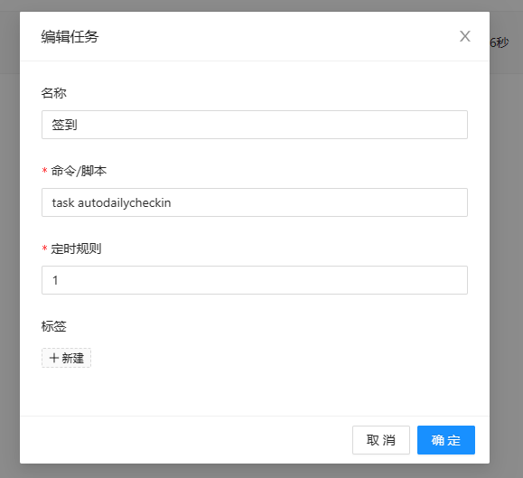
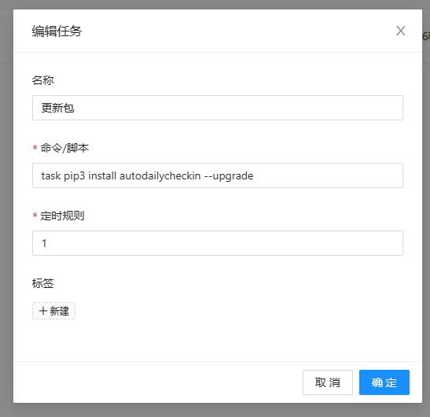

### 青龙面板安装使用

1. 下载安装青龙面板
2. 安装最新版本的库，如图所示
    

      
    

3. 将 yaoys_checkin_config.json配置文件放在
   "/ql/data/scripts/config/yaoys_checkin_config.json",
   "/ql/data/config/yaoys_checkin_config.json",
   "/ql/data/yaoys_checkin_config.json",
   "/ql/scripts/yaoys_checkin_config.json",
   "/ql/scripts/config/yaoys_checkin_config.json"
   目录均可
4. 设置定时执行的时间执行签到，使用命令如图所示：

  

    
  

5. 设置定时更新python库，如图所示：

  

    
  

### 日志文件保存

目录默认为: '/ql/data/checkin_log'